# ActionableData

This folder is the **modeling-ready slice** of the ImmunoTherapy project: the two
public datasets that pair patient-level inputs with the outcome labels we want to
predict. Everything here is real, sourced from public registries, and ready to
feed into a notebook.

## Folder layout

```
ActionableData/
├── faers/                                            FDA adverse-event reports
│   ├── checkpoint_inhibitor_adverse_events_2024_2025.csv   (36 MB, 9 drugs)
│   └── cart_therapy_adverse_events_2024_2025.csv           (5 MB,  6 products)
├── khan_jitc_2025/                                   Cytokines + irAE labels
│   ├── khan_patients_consolidated.csv                Primary modeling file (162×54)
│   ├── khan_metadata.csv                             Demographics + irAE labels (162×13)
│   ├── khan_cytokine_long.csv                        Longitudinal BL + 6–8wk values
│   └── khan_ana_long.csv                             Anti-nuclear-antibody titers
├── figures/                                          All charts shown below
└── generate_figures.py                               Reproduces the figure set
```

To regenerate the figures: `python generate_figures.py` (needs `pandas`,
`matplotlib`, `seaborn`).

---

## Dataset 1 — FAERS (FDA Adverse Event Reporting System)

**Source.** FDA Quarterly Data Extracts for 2024 Q1 – 2025 Q4, parsed and joined
from the pipe-delimited DEMO / DRUG / REAC / OUTC / INDI tables by
`scripts/faers_quarterly_pull.py` in the repo root.

**Size.** 288,179 drug-reaction rows across **76,684 unique adverse-event
reports**, covering **15 drugs**:

- **9 checkpoint inhibitors** — Pembrolizumab (Keytruda), Nivolumab (Opdivo),
  Ipilimumab (Yervoy), Atezolizumab (Tecentriq), Durvalumab (Imfinzi),
  Cemiplimab, Dostarlimab, Tremelimumab, Relatlimab.
- **6 CAR-T products** — Tisagenlecleucel (Kymriah), Axicabtagene ciloleucel
  (Yescarta), Brexucabtagene autoleucel (Tecartus), Lisocabtagene maraleucel
  (Breyanzi), Idecabtagene vicleucel (Abecma), Ciltacabtagene autoleucel
  (Carvykti).

> The repo also contains a smaller openFDA API pull in `datasets/faers/`
> (~125K rows, 5 drugs, capped by API pagination). The quarterly extract here is
> the schema-superset and is what should be used for modeling.

### Columns (20)

| Column | Meaning |
|---|---|
| `primaryid`, `caseid` | FDA report identifiers (one case = one patient event) |
| `drug_name`, `drug_class` | Generic drug + `Checkpoint Inhibitor` / `CAR-T` |
| `patient_age`, `patient_age_unit` | Age + unit (mostly `YR`) |
| `patient_sex` | `M` / `F` |
| `patient_weight_kg` | Reported weight (sparse, ~40% coverage) |
| `indication` | Cancer being treated (free text, MedDRA-flavored) |
| `reaction` | Reported adverse event term |
| `reaction_outcome` | Recovered / fatal / ongoing (when reported) |
| `serious` | `Serious` / `Non-Serious` flag from FDA |
| `seriousness_death`, `_life_threatening`, `_disabling`, `_hospitalization` | The four binary flags that drive the severity label |
| `report_date`, `country` | When + where the report was filed |
| `source_year_quarter` | Origin extract (e.g. `2024Q1`) |
| **`severity`** | **Pre-computed label: `Mild` / `Medium` / `Severe`** — the model target |

**Severity rule.**
`Severe` = death OR life-threatening OR disabling.
`Medium` = hospitalized only.
`Mild` = serious-but-other or non-serious. Combined split is roughly 46% / 27% / 27%.

### What the FAERS data looks like

**Severity mix is broadly similar across therapy classes** — useful sanity check
that the label rule is not therapy-biased.

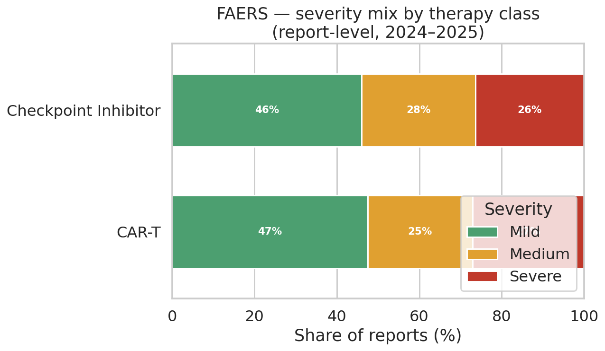

**Reports per drug.** Pembrolizumab and Nivolumab dominate the checkpoint side;
Tisagenlecleucel leads CAR-T.

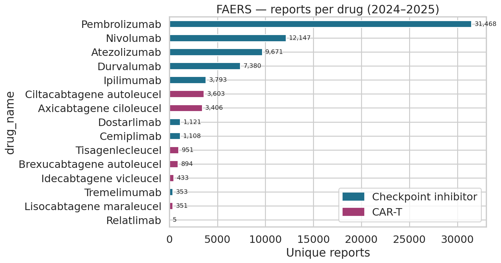

**Patient age.** The validated risk threshold (age ≥ 60, OR 1.49 for Grade 3+
irAEs) sits right inside the bulk of the cohort.

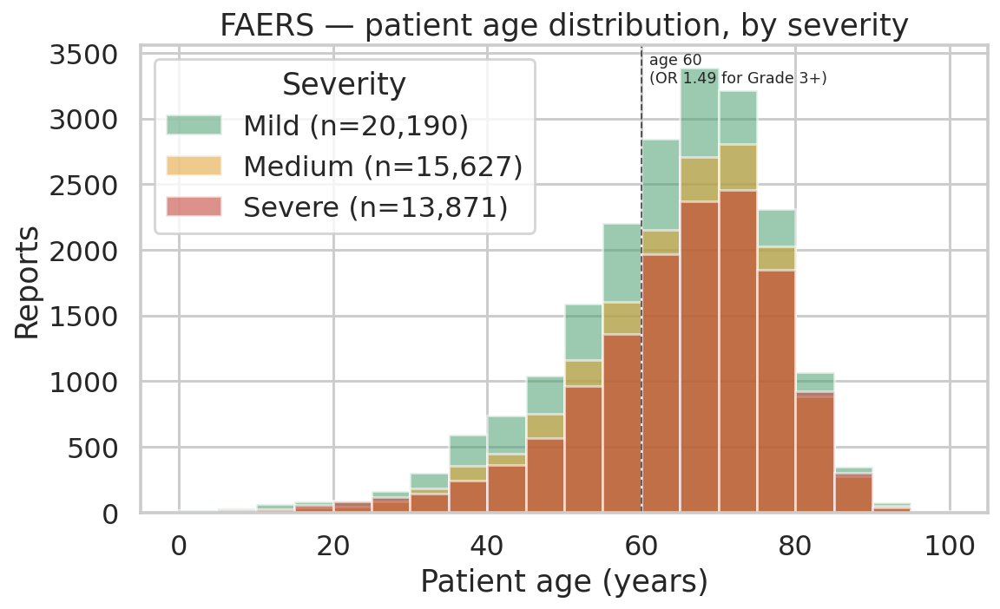

**Sex.** Severity mix is comparable between female and male patients in the raw
reports — any sex effect will need to be controlled for cancer type and drug.

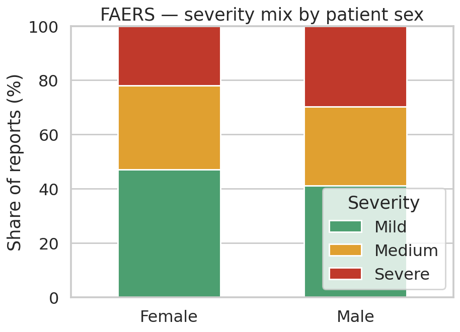

**Top reported reactions.** Pyrexia, diarrhoea, and fatigue dominate, consistent
with the published irAE literature.

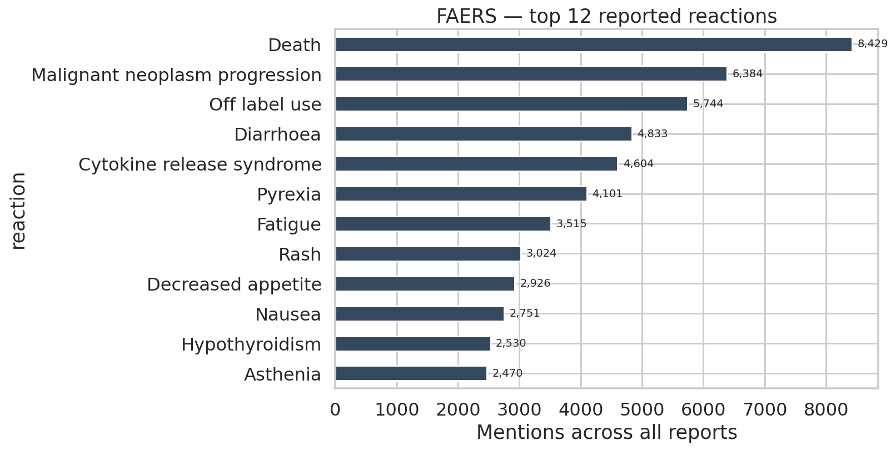

**Top cancer indications.** Lung cancer is overrepresented — checkpoint
inhibitors have the broadest NSCLC indication.

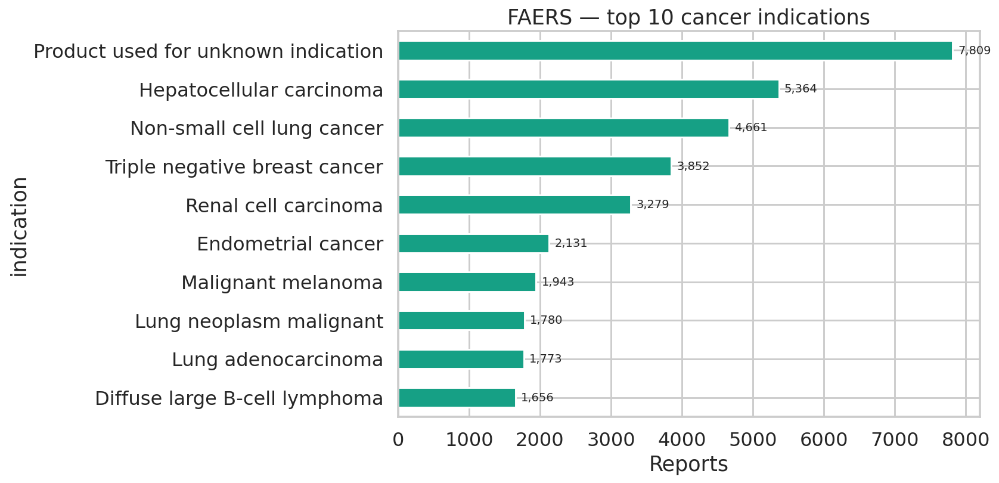

**Seriousness flags.** Hospitalization is the most common driver of the
`Medium` label; death is the dominant driver of `Severe`.

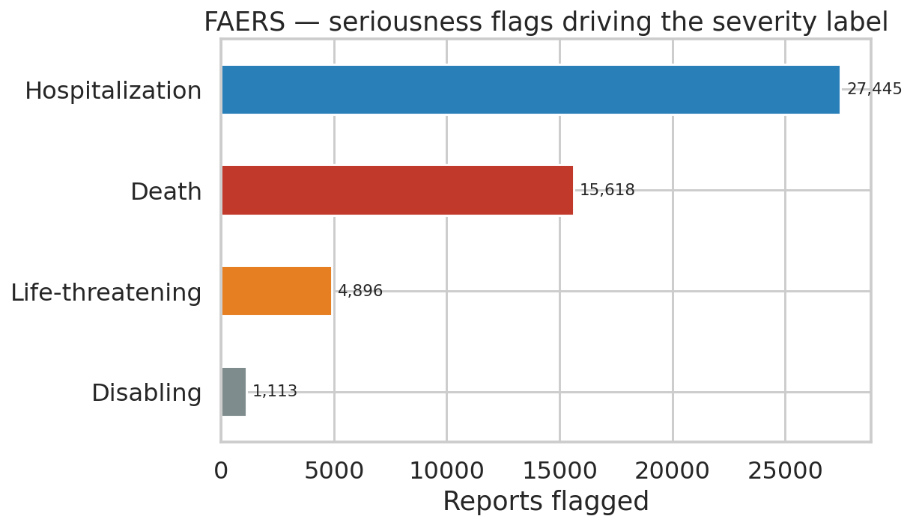

**Reporting geography.** US dominates, as expected for an FDA database.

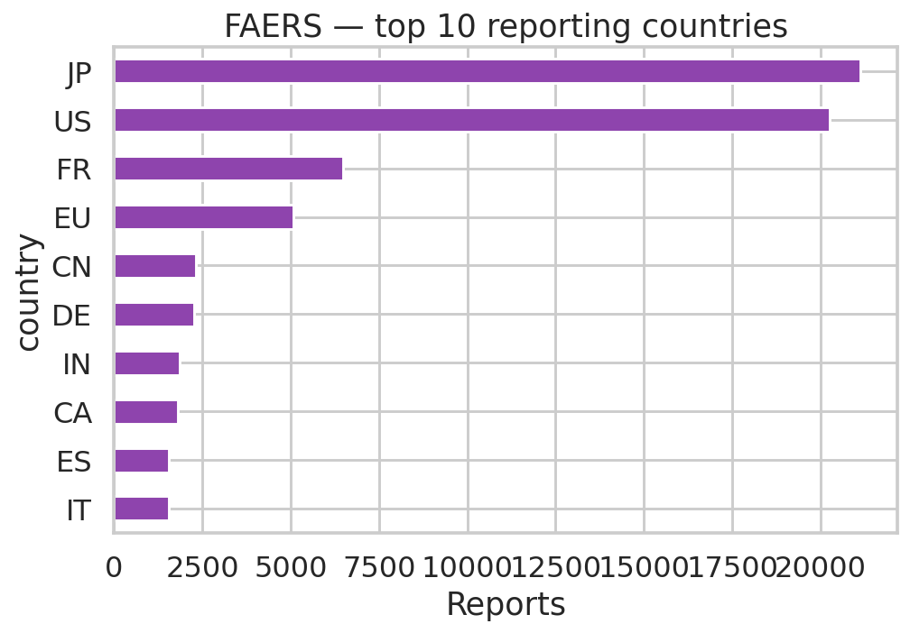

---

## Dataset 2 — Khan et al., *J Immunother Cancer* 2025

**Source.** Khan et al. *J Immunother Cancer* 2025
([DOI 10.1136/jitc-2025-012414](https://doi.org/10.1136/jitc-2025-012414));
data deposited on Zenodo
([10.5281/zenodo.17943391](https://zenodo.org/records/17943391); CC BY 4.0).
Pulled by `scripts/khan_jitc_2025_download.py`.

**Why this dataset matters.** It is the only public cohort that pairs
**patient-level cytokine measurements** with **irAE outcome labels**. It closes
the IL-6 + irAE-label half of the public-data feature gap that we documented in
the project's CLAUDE.md.

**Size.** **162 patients on ICI therapy.** 146 of them have the full 40-marker
baseline cytokine panel; all 162 have the irAE labels.

### Files

| File | Rows × Cols | Use |
|---|---|---|
| `khan_patients_consolidated.csv` | 162 × 54 | One row per patient — demographics + irAE label + 40 baseline cytokines + ANA. **Primary modeling file.** |
| `khan_metadata.csv` | 162 × 13 | Demographics + irAE labels + assay-coverage flags only |
| `khan_cytokine_long.csv` | ~1,160 | Longitudinal — baseline AND 6–8 week post-treatment cytokine values per patient |
| `khan_ana_long.csv` | ~130 | Anti-nuclear-antibody titer measurements over time (autoimmune-tendency proxy) |

### Columns of interest (consolidated file has 54 — sample shown)

| Column group | Examples | Notes |
|---|---|---|
| **Identifiers** | `patient_id` | Anonymized (`NM1`, `NM2`, …) |
| **Demographics** | `gender`, `ethnicity`, `race`, `cancer_type` | Free-text cancer types |
| **Treatment** | `ici_drug` | PD-1 mono, PD-L1 mono, CTLA-4 mono, ipi+nivo combo, other |
| **irAE labels** | `iraE_occurrence`, `highest_grade_iraE`, `iraE_organ_affected` | Binary (`Grade 0-1` / `Grade 2+`), CTCAE 0–3, free-text organs |
| **Assay flags** | `assay_scrnaseq`, `assay_cytof`, `assay_cytokine`, `assay_ana` | `X` = patient is in that assay set |
| **Cytokines (40)** | `IL-6`, `IFN-y`, `TNF-a`, `IL-1b`, `IL-10`, `IL-2`, `IL-4`, `IL-8/CXCL8`, `IL-16`, plus 31 chemokines | Baseline serum, pg/mL. `*` = below LOD; `OOR <` = below quantification |
| **Autoimmune proxy** | `ana_titer_baseline` | Available for 65/162 patients |

### What the Khan data looks like

Forty cytokines × four label types makes per-column visualization impractical;
the figures below summarize the cohort, then home in on the IL-6 result and the
panel-wide differential.

**Cohort overview** — drug regimen, sex, irAE outcome, and CTCAE grade
distribution in one panel.

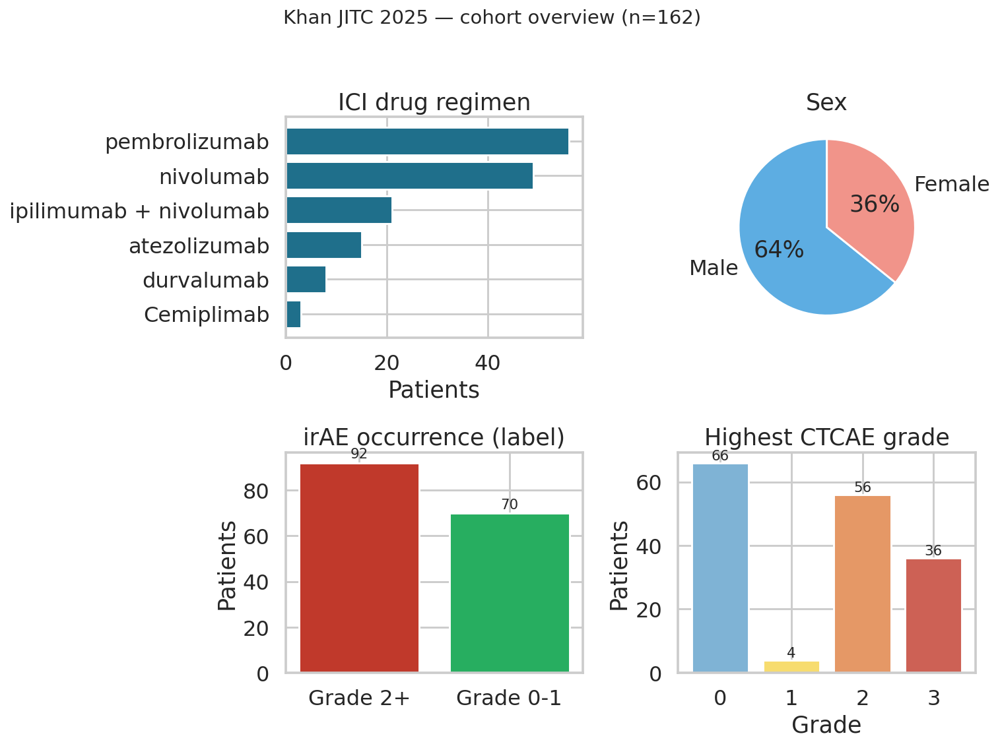

**Cancer types.** NSCLC and melanoma dominate, as expected for ICI use.

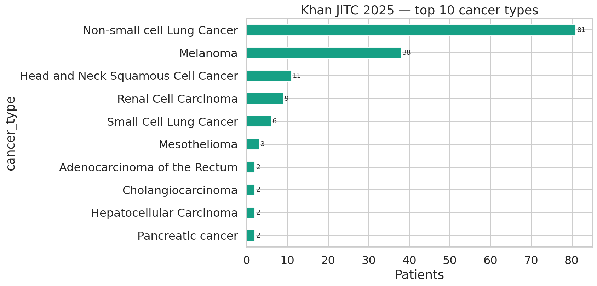

**Assay coverage.** All 162 patients have ANA + irAE labels; 146 have the full
cytokine panel; smaller subsets have CyTOF and scRNA-seq.

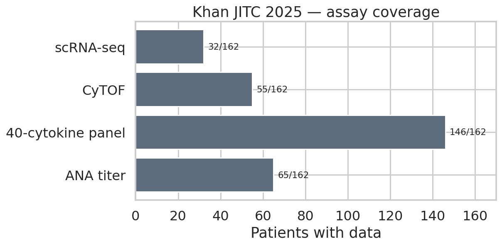

**Headline result — baseline IL-6 by irAE outcome.** This is the single feature
most directly relevant to the project's prediction target.

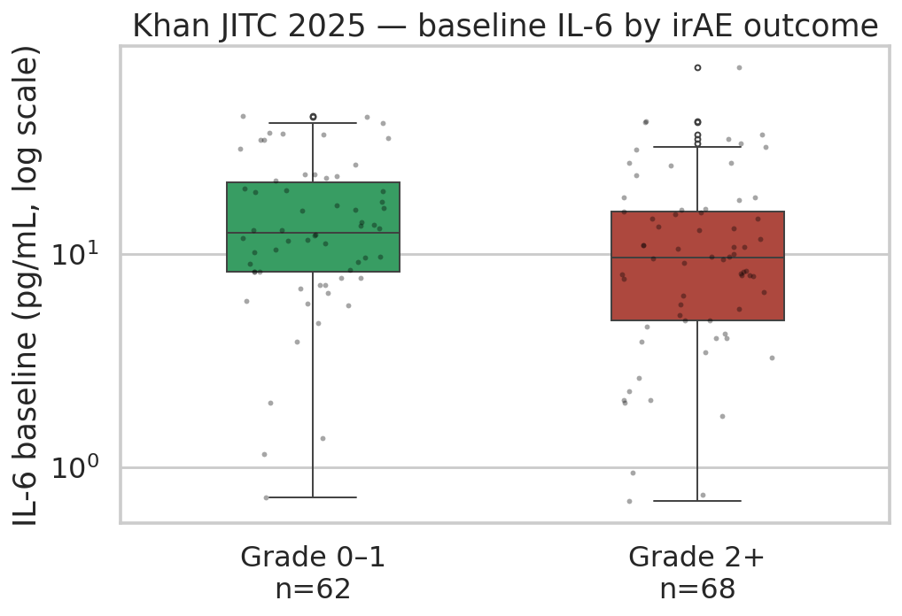

**Whole-panel differential.** For each of the 40 cytokines, the log2 ratio of
the median value in `Grade 2+` vs `Grade 0–1` patients. Markers above zero are
elevated in irAE patients at baseline; below zero are reduced.

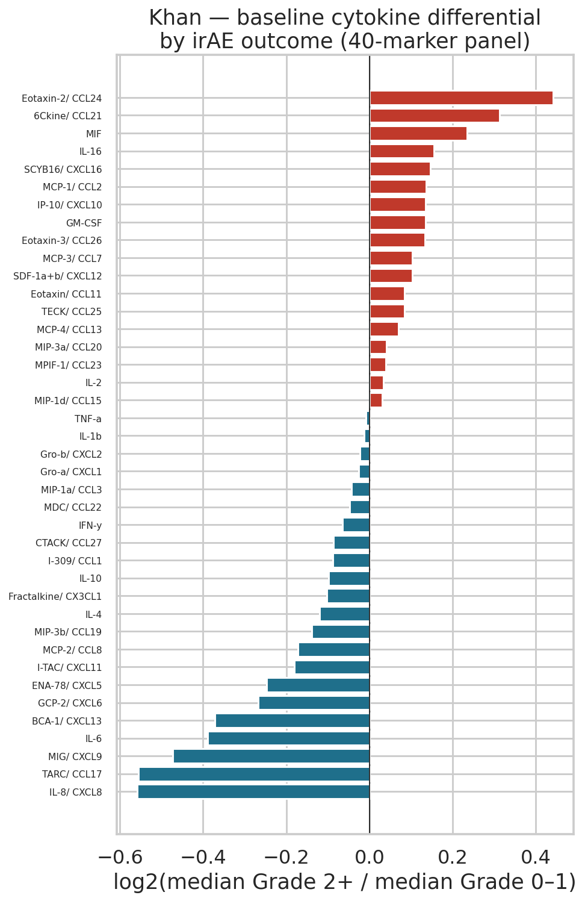

---

## Project recap and how these two datasets fit together

The project builds an **interpretable classifier that predicts the severity of
side effects** (Mild / Medium / Severe) a cancer patient will experience on
immunotherapy — both **checkpoint inhibitors** and **CAR-T** — from
pre-treatment patient and treatment data.

These two datasets are complementary, not redundant:

- **FAERS** is the *scale* layer. 76,684 real reports across 15 drugs give the
  model enough cases to learn how **demographics, drug class, and indication**
  shape the severity distribution. It carries the severity label the project
  defines, but it has no biomarker columns.
- **Khan JITC 2025** is the *biology* layer. Only 162 patients, but it carries
  the **40-cytokine baseline panel paired with irAE outcome labels** — the
  measurements FAERS will never have. It is the public dataset that lets us
  evaluate whether biomarkers like IL-6 add predictive signal on top of the
  demographic features the FAERS model relies on.

Train the main severity classifier on FAERS; train a parallel "any irAE"
classifier on Khan using the cytokine panel; compare the demographic-effect
directions across the two to validate that the FAERS-learned signal is
clinically real and not an artifact of FDA reporting bias.
